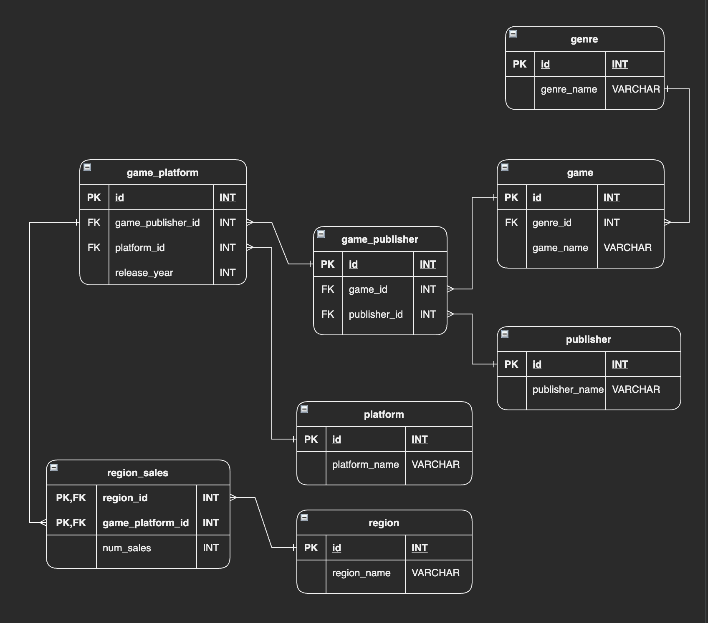

# Video Game Box Service

Django React Framework JWT App

Box services have sprung up in the last few years to offer a certain category of tailored goods (games, makeup, food/drinks, clothes, etc.) to busy people who don't have the time to search out the individual items themselves

This is a website for such a subscription box company

## Technology

- Django Rest Framework
- React.js
- Bootstrap

## Features

- Backend API complete with routes, views, and models to handle the applications users and user profiles
- New user registration portal to start receiving regular monthly boxes
- Registered users:
  - Can take a survey about likes/dislikes which will then put them in a targeted demographic to get the box contents related to interests
  - Choose between three different payment tiers for box service, with each tier being clearly different with what the contents of the box will be
  - Account details view to easily see how much is owed this month for budget purposes
  - Can pay for monthly subscription using PayPal or Stripe API (sandbox account)
- Administrator user
  - See an account breakdown:
    - Total amount of accounts
    - Percentage belonging to which demographic
    - Monthly revenue generation
  - Data visualization (line cart) view of the popularity of the different types of box services offered

## Resources

### Database

All video game data is sourced from [Database Star](https://www.databasestar.com/sample-database-video-games/ "Sample Dataset") thanks to Ben Brumm

Table specific information provided by Databse Star can here found [here](./resources/table_details.md)

### Styling

Heavily influenced by [Retro Game Treasure](https://www.retrogametreasure.com/) box Service

